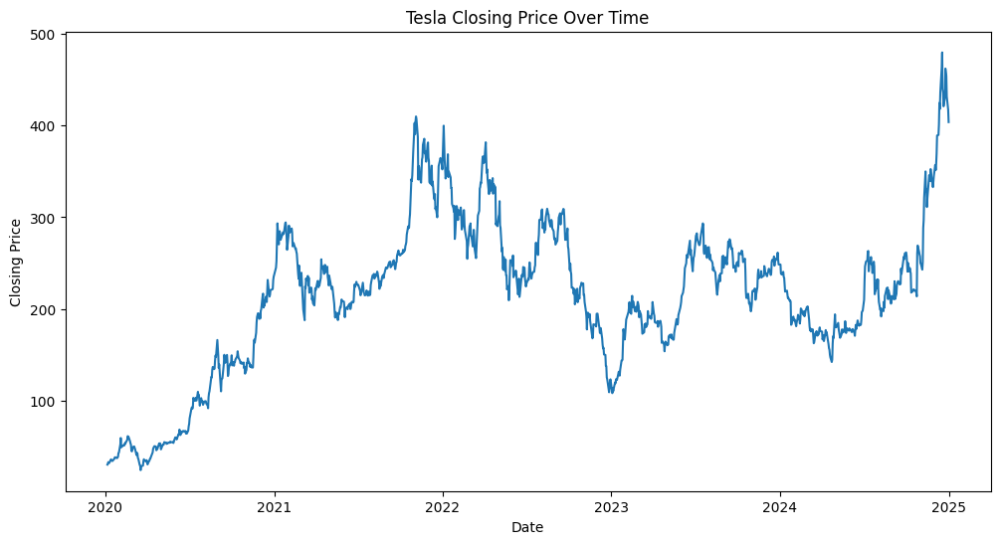
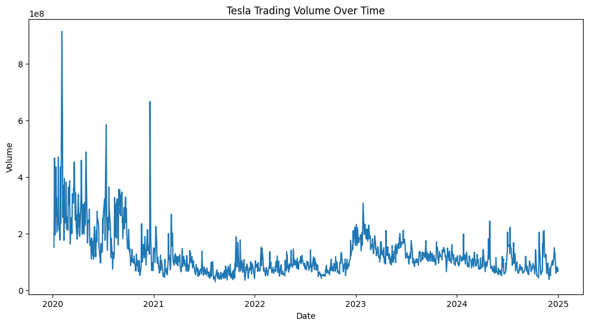
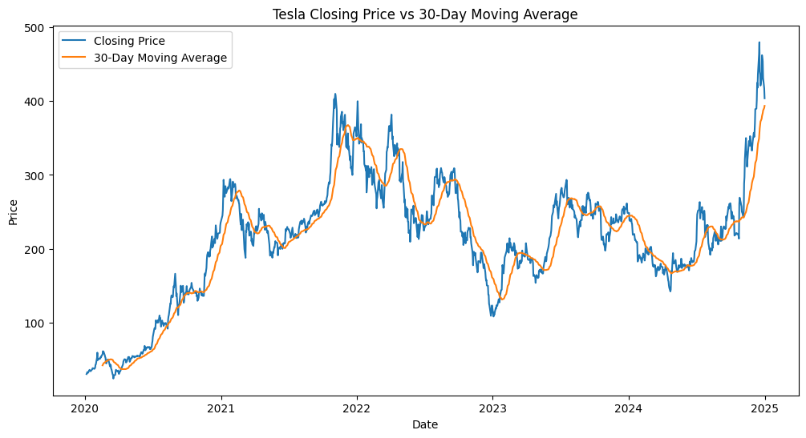
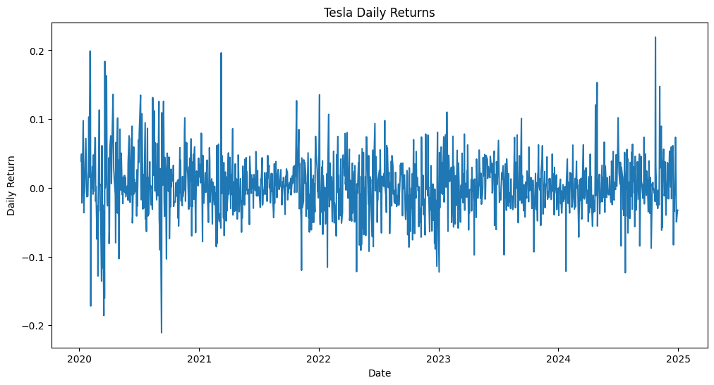
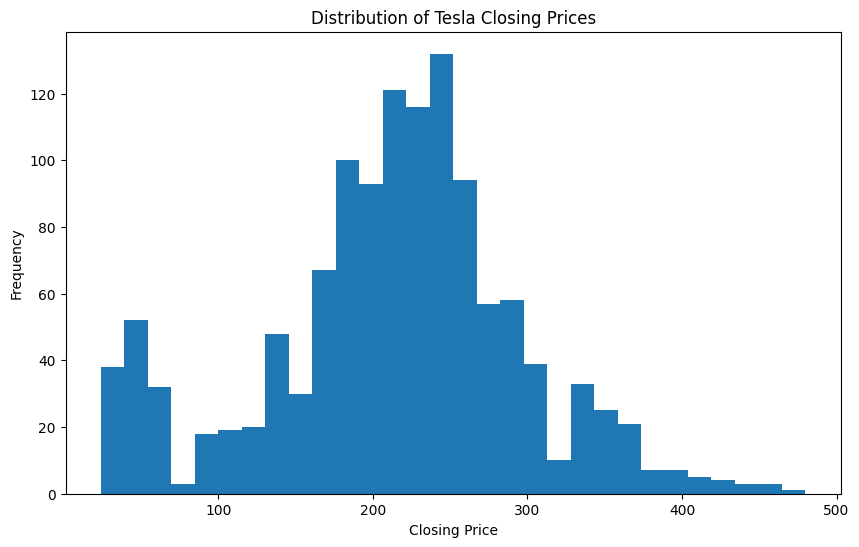
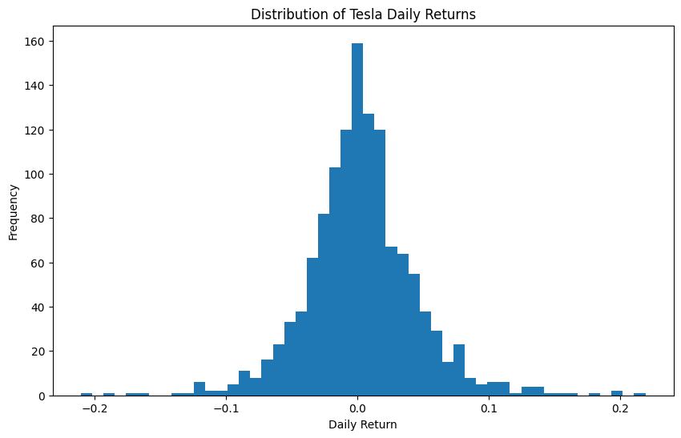
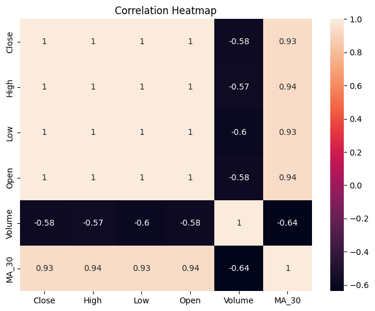
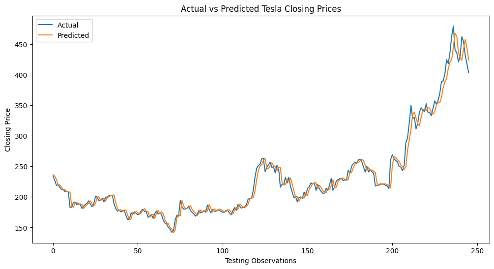

# 📈 Tesla Stock Price Prediction and Forecasting

An end-to-end data science project that analyzes historical Tesla stock data and develops machine learning models to predict and forecast stock prices.

This project combines Exploratory Data Analysis (EDA), feature engineering, Linear Regression, and realistic time-series forecasting techniques to understand stock market behavior and evaluate predictive performance.

---

## 🎯 Project Objectives

The objectives of this project were to:

- Analyze Tesla's historical stock performance.
- Explore trends and relationships within the data.
- Visualize stock price movements and trading behavior.
- Build a machine learning model to predict stock prices.
- Identify and address information leakage.
- Develop a realistic next-day forecasting model.
- Evaluate and compare different modeling approaches.

---

## 📂 Dataset

The dataset was obtained using the Yahoo Finance API through the `yfinance` library.

**Company:** Tesla Inc. (TSLA)

Features included:

- Open Price
- High Price
- Low Price
- Close Price
- Trading Volume

---

## 🛠 Technologies Used

- Python
- JupyterLab
- Pandas
- NumPy
- Matplotlib
- Seaborn
- Scikit-learn
- yfinance
- Git & GitHub

---

# 🔍 Exploratory Data Analysis (EDA)

## Tesla Closing Price Trend



**Key Insight:**

Tesla's stock exhibited a strong upward trend over time, reflecting substantial growth alongside periods of volatility.

---

## Trading Volume Trend



**Key Insight:**

Trading activity showed several spikes, often coinciding with major price movements and heightened investor interest.

---

## Moving Average Analysis



**Key Insight:**

The moving average smoothed short-term fluctuations and highlighted the long-term direction of Tesla's stock.

---

## Daily Returns



**Key Insight:**

Most daily returns clustered around zero, indicating that extreme gains and losses were relatively infrequent.

---

## Distribution of Closing Prices



**Key Insight:**

The distribution suggests that Tesla traded across multiple price regimes over the study period.

---

## Distribution of Daily Returns



**Key Insight:**

Daily returns followed an approximately bell-shaped distribution with occasional extreme movements.

---

## Correlation Heatmap



**Key Findings:**

- Open, High, Low, and Close prices exhibited extremely high correlations.
- Volume showed a moderate negative relationship with price variables.
- Multicollinearity among price features informed later modeling decisions.

---

# 🤖 Machine Learning Models

## Phase A: Same-Day Price Prediction

The first model used:

- Open
- High
- Low
- Volume

to predict Tesla's closing price.

### Results

| Metric | Score |
|----------|---------|
| MAE | 2.31 |
| RMSE | 3.23 |
| R² | 0.9986 |

### Limitation

Although highly accurate, this approach relied on information from the same trading day and therefore suffered from **information leakage**, making it unsuitable for real-world forecasting.

---

## Phase B: Next-Day Forecasting

A realistic forecasting approach was developed using only historical information available before prediction.

Features included:

- Lag_1
- Lag_2
- MA_30
- Daily_Return
- Volume

Target:

- Next-Day Closing Price

### Results

| Metric | Score |
|----------|---------|
| MAE | 7.40 |
| RMSE | 11.06 |
| R² | 0.9762 |

---

## Actual vs Predicted Closing Prices



**Key Insight:**

The forecasting model closely tracked the actual closing prices, demonstrating strong predictive capability despite the challenges associated with financial time-series forecasting.

---

# 🔄 Comparison of Approaches

| Metric | Phase A | Phase B |
|----------|----------|----------|
| MAE | 2.31 | 7.40 |
| RMSE | 3.23 | 11.06 |
| R² | 0.9986 | 0.9762 |

### Lessons Learned

- High performance does not necessarily indicate a better model.
- Information leakage can produce misleading results.
- Realistic forecasting should rely only on information available at prediction time.
- Historical market patterns can provide valuable predictive signals.

---

# 🚀 Future Improvements

Potential enhancements include:

- Predicting price direction using classification models.
- Applying TimeSeriesSplit cross-validation.
- Implementing Random Forest and XGBoost models.
- Exploring LSTM neural networks.
- Forecasting multiple days ahead.
- Deploying the model using Streamlit.

---

# ▶️ How to Run This Project

Clone the repository:

```bash
git clone https://github.com/Ernest717/tesla-stock-price-prediction-and-forecasting.git
```

Navigate into the project directory:

```bash
cd tesla-stock-price-prediction-and-forecasting
```

Install dependencies:

```bash
pip install -r requirements.txt
```

Launch JupyterLab:

```bash
jupyter lab
```

Open the notebook and run all cells.

---

# 👤 Author

**Ernest**

Data Analyst | Data Scientist | Quantitative Analytics Enthusiast

GitHub: https://github.com/Ernest717

---

# ⭐ Acknowledgements

This project was completed as part of the DecodeLabs Internship Program and further extended as a portfolio project to demonstrate practical data science and machine learning skills.